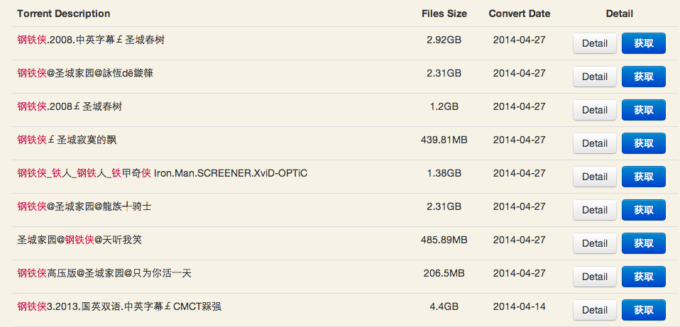
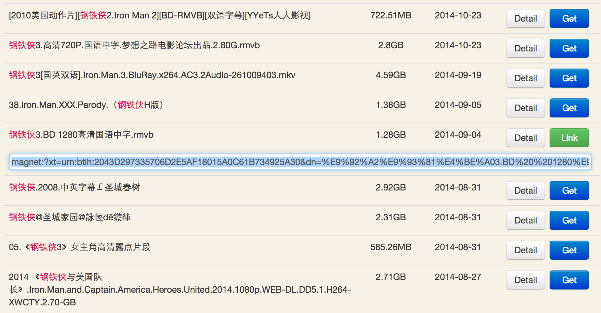

# btspread

## 简介

[btspread](http://www.btspread.com)是一个资源分享网站，有时候可以找到一些稀有资源

但是有一点不太方便，当搜索出所需的内容之后，需要再点击一次标题或者`detail`按钮才可以看到具体的磁力链接。

本插件的功能有：

* 添加直接获取地址的按钮
* 输入框自动获得焦点 
* 屏蔽弹窗广告

## 使用

下载地址：[btspread-v1.2.0](https://github.com/chshouyu/btspread/releases)

在扩展程序管理页面，将`btspread-v1.2.0.crx`文件拖到页面中，确认添加即可